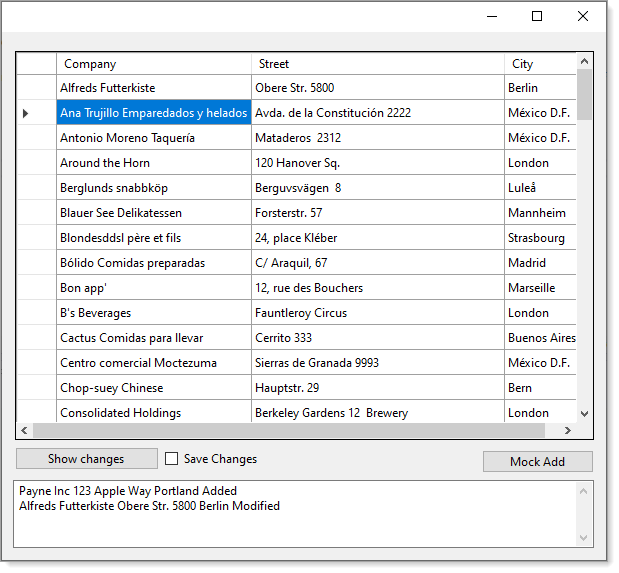

# About

Simple example working with .[Local](https://docs.microsoft.com/en-us/dotnet/api/microsoft.entityframeworkcore.dbset-1.local?view=efcore-5.0) version of data which by following this code sample learn how to look at changes prior to performing save operation back to the database.

**Local definition**

Gets an [LocalView&lt;TEntity&gt;](https://docs.microsoft.com/en-us/dotnet/api/microsoft.entityframeworkcore.changetracking.localview-1?view=efcore-5.0) that represents a local view of all Added, Unchanged, and Modified entities in this set.

This local view will stay in sync as entities are added or removed from the context. Likewise, entities added to or removed from the local view will automatically be added to or removed from the context.

Adding an entity to this collection will cause it to be tracked in the [Added](https://docs.microsoft.com/en-us/dotnet/api/microsoft.entityframeworkcore.entitystate?view=efcore-5.0#Microsoft_EntityFrameworkCore_EntityState_Added) state by the context unless it is already being tracked.

Removing an entity from this collection will cause it to be marked as [Deleted](https://docs.microsoft.com/en-us/dotnet/api/microsoft.entityframeworkcore.entitystate?view=efcore-5.0#Microsoft_EntityFrameworkCore_EntityState_Deleted), unless it was previously in the Added state, in which case it will be detached from the context.

**Check out** 
- [Methods](https://docs.microsoft.com/en-us/dotnet/api/microsoft.entityframeworkcore.entitystate?view=efcore-5.0#Microsoft_EntityFrameworkCore_EntityState_Deleted)
- [Events](https://docs.microsoft.com/en-us/dotnet/api/microsoft.entityframeworkcore.changetracking.localview-1?view=efcore-5.0#events)
 
---

In the screenshot below, one record was modified and a new record added.

