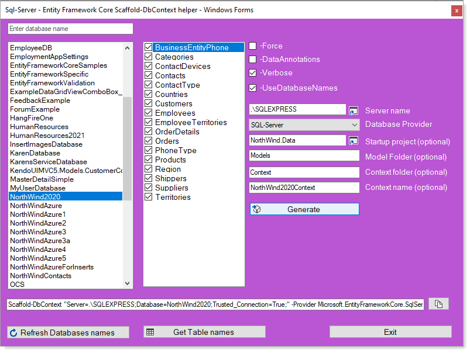

# EF Core 5 with VB.NET in Windows forms


| Introduction  |
| :--- |
| What to expect, learn how to reverse engineer a database for EF Core 5 along with tapping into various features of EF Core. Do not just quickly examine code, copy and paste to a project but instead take time to learn then once understood then write code based off information presented here. See [reverse engineering options](https://github.com/karenpayneoregon/efcore-vbnet-scaffolding/blob/master/efCore.md).|
| Stay tune for more on working with VB.NET and EF Core 5 and higher |

Since `VB.NET` arrived developer common method to interact with databases has been with a [data provider](https://docs.microsoft.com/en-us/dotnet/framework/data/adonet/data-providers) in tangent with [TableAdapter](https://docs.microsoft.com/en-us/visualstudio/data-tools/directly-access-the-database-with-a-tableadapter?view=vs-2019), 
[DataAdapter](https://docs.microsoft.com/en-us/dotnet/api/system.data.common.dataadapter?view=net-5.0) or 
using a [connection](https://docs.microsoft.com/en-us/dotnet/api/system.data.sqlclient.sqlconnection?view=dotnet-plat-ext-5.0) and [command](https://docs.microsoft.com/en-us/dotnet/api/system.data.sqlclient.sqlcommand?view=dotnet-plat-ext-5.0).

Then there is Entity Framework and Entity Framework Core where Entity Framework Core (`EF Core`) is currently and has been another option for interacting with databases.

EF Core makes interacting with data extremely easy although until recently there has not been a simple way to setup EF Core for VB.NET unlike C# where there are many options to setup EF Core.


# Reverse engineering

Reverse engineering is the process of scaffolding entity type classes and a DbContext class based on a database schema. It can be performed using the Scaffold-DbContext command of the EF Core Package Manager Console (PMC) tools or the dotnet ef dbcontext scaffold command of the .NET Command-line Interface ([CLI](http://example.com)) tools. In this article, the PMC will be used, not the CLI tools method.

The following shows a simple command to create a DbContext and classes to represent data in a SQL-Server database.

The database is on [SQL-Server express edition](https://www.microsoft.com/en-us/Download/details.aspx?id=101064) with a database named [NorthWind2020](https://gist.github.com/karenpayneoregon/c3361a4d4503c8851dcb43f8d6b2526f).

```
Scaffold-DbContext
    "Server=.\SQLEXPRESS;Database=NorthWind2020;Trusted_Connection=True;"
    -Provider Microsoft.EntityFrameworkCore.SqlServer
    -t "Contact","ContactType"
```

To get started, install the following [NuGet package](https://github.com/efcore/EFCore.VisualBasic) which is in alpha version.

By following Microsoft [instructions](https://docs.microsoft.com/en-us/ef/core/managing-schemas/scaffolding?tabs=dotnet-core-cli) will walkthough reverse engineering process which must be done by writting out the scaffold script then run in Visual Studio Developer PowerShell window or using dotnet ef command at the command prompt. This leaves room for errors e.g. for processing a Customer**s** table Customer is entered, an non-existing table name.

A better method is to use the [following utility](https://social.technet.microsoft.com/wiki/contents/articles/53258.windows-forms-entity-framework-core-reverse-engineering-databases.aspx?fbclid=IwAR3AJK-vxEfKLnA-9-jinLHw9MKWAggM-zqW5vobhH1za_703bGyy2sBNEU) (written in C# which does not matter, it's a windows form interface which needs any code changes). Simple read how to use in the [article](https://social.technet.microsoft.com/wiki/contents/articles/53258.windows-forms-entity-framework-core-reverse-engineering-databases.aspx?fbclid=IwAR3AJK-vxEfKLnA-9-jinLHw9MKWAggM-zqW5vobhH1za_703bGyy2sBNEU), source code is [here](https://github.com/karenpayneoregon/ScaffoldDbContextHelper).



Once the process has completed using the utility

- `Data folder` contains a class for configuring and connecting to database tables and stored procedures.
  - The Context class (in this repository is [NorthWindConect.vb](https://github.com/karenpayneoregon/efcore-vbnet-scaffolding/blob/master/NorthWindCoreLibrary/Data/NorthWindContext.vb) sets up the database connection string with a comment to change it as it's not safe. This has been changed to store the connection string in a .json file which will be explained shortly.
  - Code in the Data.Interceptors was added after reverse engineering process.
- `Model folder` contains classes which represents tables which were reversed engineered, example [Contact.vb](https://github.com/karenpayneoregon/efcore-vbnet-scaffolding/blob/master/NorthWindCoreLibrary/Models/Contact.vb).

# Code samples

Typicaly new developers will write as much code as possible in a form then and only then will consider using classes in a single form project which is fine when there will never a need to use this code.

A better path is to separate data operations from business logic were both are separated from the user interface.

- In [DataGridViewExample](https://github.com/karenpayneoregon/efcore-vbnet-scaffolding/tree/master/DataGridViewExample) project all code is in a single project, not good for reuse.


Data is loaded from DataOperations class, CustomersLocal method

```vbnet
Public Shared Async Function CustomersLocal() As Task(Of BindingList(Of Customer))

    Return Await Task.Run(Async Function()
                              Await Context.Customers.LoadAsync()
                              Return Context.Customers.Local.ToBindingList()
                          End Function)

End Function
```

In is called in form `Shown` event.

```vbnet
Try

    Dim peopleLocalList As BindingList(Of Customer) = Await DataOperations.CustomersLocal()
    _bindingSource.DataSource = peopleLocalList

    CustomersDataGridView.DataSource = _bindingSource

    CustomersDataGridView.ExpandColumns(True)

Catch ex As Exception
    MessageBox.Show($"Failed to load data.{Environment.NewLine}{ex.Message}")
End Try
```

Perform add, edit and delete opterations and see the results. Note deleted records will not show, instead they are marked as deleted.

This method in DataOperations class is called from a button click event in the form.

```vbnet
''' <summary>
''' Get local changes, deleted records will not show
''' </summary>
''' <returns></returns>
Public Shared Function Show() As String

    Dim builder As New StringBuilder()

    For Each customer In Context.Customers.Local

        If Context.Entry(customer).State <> EntityState.Unchanged Then
            builder.AppendLine($"{customer.CompanyName} {customer.Street} {customer.City} {Context.Entry(customer).State}")
        End If

    Next

    Return builder.ToString()

End Function
```

Button Click event in the form.

```vbnet
Private Sub ShowChangesButton_Click(sender As Object, e As EventArgs) Handles ShowChangesButton.Click

    Dim changes = DataOperations.Show()

    If Not String.IsNullOrWhiteSpace(changes) Then

        ChangesTextBox.Text = changes

        If SaveChangesCheckBox.Checked Then
            MessageBox.Show($"Change count - {DataOperations.Context.SaveChanges()}")
        End If

    Else
        ChangesTextBox.Text = ""
    End If

End Sub
```

In another button a mocked add is performed (in the DataGridViewExample1 an actual add is performed).

```vbnet
Private Sub AddButton_Click(sender As Object, e As EventArgs) Handles AddButton.Click

    _bindingSource.AddPersonCustomer(New Customer() With {
                                                 .CompanyName = "Payne Inc",
                                                 .Street = "123 Apple Way",
                                                 .City = "Portland",
                                                 .ContactId = 1,
                                                 .ContactTypeIdentifier = 1
                                                 })

    _bindingSource.MoveLast()

End Sub
```
`AddPersonCustomer` is a language extention.

```vbnet
Namespace Extensions
    Module BindingSourceExtensions
        <Runtime.CompilerServices.Extension>
        Public Sub AddPersonCustomer(sender As BindingSource, customer As Customer)
            DirectCast(sender.DataSource, BindingList(Of Customer)).Add(customer)
        End Sub
    End Module
End Namespace
```


- In [DataGridViewExample1](https://github.com/karenpayneoregon/efcore-vbnet-scaffolding/tree/master/DataGridViewExample) data operations are all in the project [NorthWindCoreLibrary](https://github.com/karenpayneoregon/efcore-vbnet-scaffolding/tree/master/NorthWindCoreLibrary) which allows for code reuse.


Data is loaded the same as `DataGridViewExample project` but in this case from the class project [NorthWindCoreLibrary](https://github.com/karenpayneoregon/efcore-vbnet-scaffolding/tree/master/NorthWindCoreLibrary).

Show changes and save changes is done in [NorthWindCoreLibrary](https://github.com/karenpayneoregon/efcore-vbnet-scaffolding/tree/master/NorthWindCoreLibrary) project.


Adding a new customer is done in a modal child form.


If when adding there is a validation error e.g. CompanyName is required by annotating the CompanyName property.

```vbnet
Namespace Models
    Public Partial Class Customer
        Public Sub New()
            Orders = New HashSet(Of Order)()
        End Sub

        ''' <summary>
        ''' Id
        ''' </summary>
        Public Property CustomerIdentifier As Integer
        ''' <summary>
        ''' Company
        ''' </summary>
        <Required(ErrorMessage:="{0} is required")>
        Public Property CompanyName As String
```

An error message is displayed.


When there are no errors click the Add button the following event is raised passing the new Customer to the calling form which in turn adds the new Customer to the BindingList.

```vbnet
Public Event AddCustomerHandler As OnAddCustomer
```

</br>

```vbnet
Private Sub AddButton_Click(sender As Object, e As EventArgs) Handles AddButton.Click

    Dim customer As New Customer With {
        .CompanyName = CompanyNameTextBox.Text,
        .ContactId = CType(ContactComboBox.SelectedItem, Contact).ContactId,
        .ContactTypeIdentifier = CType(ContactTypeComboBox.SelectedItem, ContactType).ContactTypeIdentifier,
        .Street = StreetTextBox.Text,
        .City = CityTextBox.Text,
        .CountryIdentifier = CType(CountryComboBox.SelectedItem, Country).CountryIdentifier
    }

    Dim validationResult As EntityValidationResult = ValidationHelper.ValidateEntity(customer)

    If validationResult.HasError Then
        MessageBox.Show(validationResult.ErrorMessageList())
    Else
        RaiseEvent AddCustomerHandler(customer)
        DialogResult = DialogResult.OK
    End If

End Sub
```

Let's look at how the add new customer form is setup. Simply create a new instance of the add form and subscribe to the `AddCustomerHandler` event.

```vbnet
Private Sub AddButton_Click(sender As Object, e As EventArgs) Handles AddButton.Click

    Dim customerForm As New AddCustomerForm

    AddHandler customerForm.AddCustomerHandler, AddressOf NewCustomerFromAddForm

    Try
        customerForm.ShowDialog()
    Finally

        RemoveHandler customerForm.AddCustomerHandler, AddressOf NewCustomerFromAddForm
        customerForm.Dispose()

    End Try

End Sub
```

Here is the event listening to add a new Customer.

```vbnet
Private Sub NewCustomerFromAddForm(sender As Customer)
    _bindingSource.AddPersonCustomer(sender)
    _bindingSource.MoveLast()
End Sub
```


| Note  |
| :--- |
| In both projects there is limited code in each form, only what can not be placed into a class outside of the form. This keeps with separating concerns and if a form gets corrupt simply create a new form and copy/paste code from one form to the other form.  |


## Unit test


Although unit testing is commonly dismissed for the occasional developer and/or hobbyist coder because it is too much to learn and/or take time to write.

There are many benefits

- Confirm code works as expected without involving other parts of a project like the user interface
- Once confirmed, later after one or more changes are made that break the application unit test can asssist in finding a problem along with finding the project by one or more testing methods or completely eliminate tested code.

Seeing all test passing is great :heavy_check_mark:


Check out some basic unit test in the unit test project [NorthWindCoreUnitTest](https://github.com/karenpayneoregon/efcore-vbnet-scaffolding/tree/master/NorthWindCoreUnitTest).

There is one unit test class in the root of the test project as a partial class UnitTest1 while there is another unit test, UnitTest1 as a partial class under the Base folder. The base folder code is for assisting with actual test methods. This keeps the actual test methods clean and in some case reusable code.

For several test methods validation is done by using SQL-Server data provider rather than hard code hard coded values as records may be added, edited or delete which would invalidate tests.

For since to get a actual count in a table.

In both projects there is limited code in each form, only what can not be placed into a class outside of the form. This keeps with separating concerns and if a form gets corrupt simply create a new form and copy/paste code from one form to the other form.


# Resources

- [DataGridView/Entity Framework common operations](https://social.technet.microsoft.com/wiki/contents/articles/53804.datagridviewentity-framework-common-operations-part-1.aspx) (**Part 1**)
- [DataGridView/Entity Framework common operations](https://social.technet.microsoft.com/wiki/contents/articles/53821.datagridviewentity-framework-common-operations-part-2.aspx) (**Part 2**)
- [DataGridView/Entity Framework common operations](https://social.technet.microsoft.com/wiki/contents/articles/53822.datagridviewentity-framework-common-operations-part-2-a.aspx) (**Part 2 A**)


