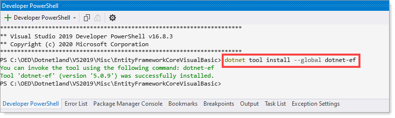
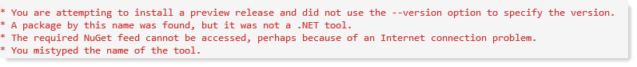
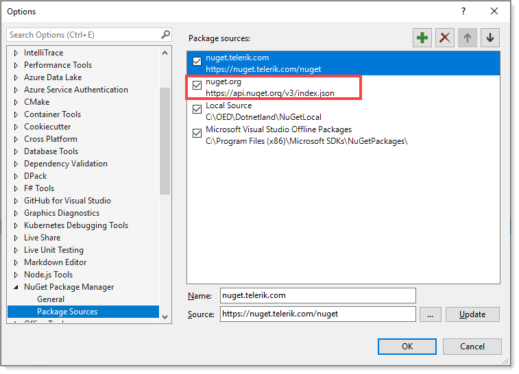
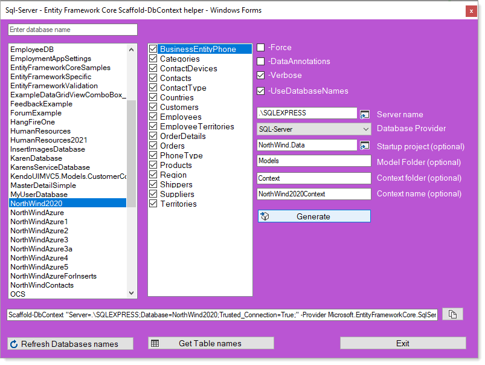

# Reverse engineer script choices

There are two ways to reverse engineer for VB-NET.

Reverse engineering for this Visual Studio was done with the second option which was written by Karen Payne.

## First: dotnet commnand

```
dotnet ef dbcontext scaffold ... --table Customers --table Contacts
```

Which requires ef command to be installed for dotnet which can be done inside Visual Studio using the Developer PowerShell.



If this is not done the following error message will be displayed.



There are several reasons, a common reason is NuGet package source order under the Visual Studio menu &#8594; Tools &#8594; Options, search for NuGet. 

If you see other sources e.g. then the default in this case is `Telerik`, either move `Nuget.org` to the first item or uncheck the first and then perform the installation.



## Second: Scaffold-DbContext

Reverse engineering is the process of scaffolding entity type classes and a DbContext class based on a database schema. It can be performed using the Scaffold-DbContext command of the EF Core Package Manager Console (PMC) tools or the dotnet ef dbcontext scaffold command of the .NET Command-line Interface (CLI) tools. In this article, the PMC will be used, not the CLI tools method.

This requires the following NuGet packages to be installed for the project using EF Core.

```
Microsoft.EntityFrameworkCore.Tools
Microsoft.EntityFrameworkCore.Design
```

Which one is best? it depends on personal perference.

---

For the Scaffold-DbContext look at [the following utility](https://social.technet.microsoft.com/wiki/contents/articles/53258.windows-forms-entity-framework-core-reverse-engineering-databases.aspx?fbclid=IwAR3AJK-vxEfKLnA-9-jinLHw9MKWAggM-zqW5vobhH1za_703bGyy2sBNEU) which asssist with putting together the Scaffold-DbContext command.


