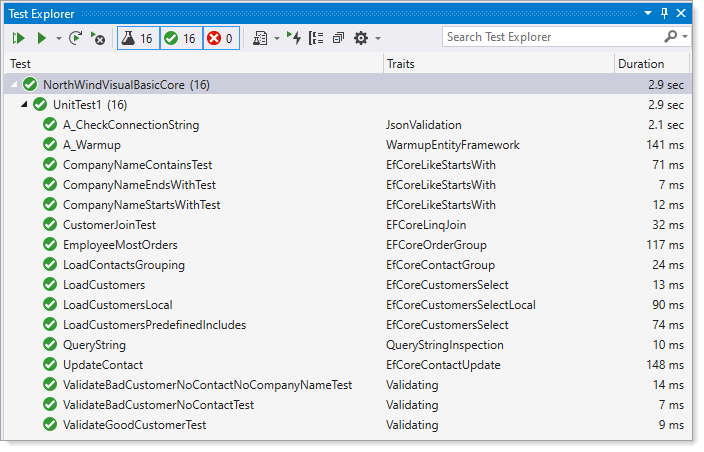

# About 

Code within this repository provide a base to show that work Microsoft has done to support `VB.NET` developers writing desktop solution with `Visual Studio 2019` and higher targeting `.NET Core Framework` to use `EF Core 5`.

:white_circle:  A mixture of simple and intermediate read samples. 

:white_circle:  No CRUD as this requires some form of mocking expect one `update example` in `ContactsOperations`.

:white_circle: All samples are in unit test methods

---

- To get started: https://github.com/efcore/EFCore.VisualBasic
- **Before running code here** 
  - First run the following script [Data script](https://gist.github.com/karenpayneoregon/40a6e1158ff29819286a39b7f1ed1ae8) 
  - Ensure all Git packages are loaded


</br>

# Reverse engineering

Reverse engineering is the process of scaffolding entity type classes and a DbContext class based on a database schema. It can be performed using the Scaffold-DbContext command of the EF Core Package Manager Console (PMC) tools or the dotnet ef dbcontext scaffold command of the .NET Command-line Interface (CLI) tools. In this article, the PMC will be used, not the CLI tools method.

The following shows a simple command to create a DbContext and classes to represent data in a SQL-Server database.

```
Scaffold-DbContext
    "Server=.\SQLEXPRESS;Database=DateTimeDatabase;Trusted_Connection=True;"
    -Provider Microsoft.EntityFrameworkCore.SqlServer
    -t "Events","TimeTable"
```

Breaking down this command, the first argument indicates a server and database on the server following by - t which list the tables to scaffold. A DbContext and two classes are generated in the root folder of the current project.

A robust example Which indicates where classes are placed, in this example the following switches are used, many have both a full name and a shortcut name, for example, -v is a shortcut name for -Verbose, 

**Important**

Running the command in a multi-project solution where there is a Windows Form and Class project generally the form project is set as the startup project. When running the command the scaffolding process will indicate the build failed as the startup project does not have the package Microsoft.EntityFrameworkCore.Tools Jump installed. To fix this in Package Manager Console select the class project in the Default project dropdown then run the command again. Note there are switches to handle this for you which will be gone over later.


```
Scaffold-DbContext
    "Server=.\SQLEXPRESS;Database=DateTimeDatabase;Trusted_Connection=True;"
    -Provider Microsoft.EntityFrameworkCore.SqlServer
    -OutputDir DateModels
    -Context DateTimeContext 
    -v
    -f 
    -DataAnnotations 
    -project NorthWind.Data
    -startupproject NorthWind.Data
    -ContextDir Contexts
    -t "Events","TimeTable"
```


# Using Entity Framework Tools

In short, write out the command using the following common parameters where if there are typos or incorrectly specifying a switch or missing a switch the command will need to be modified and executed again. 

| Argument  |  Description  |
| :---         |  :---  |
| -Connection <String>|	The `connection string` to the database. For ASP.NET Core 2.x projects, the value can be name=<name of connection string>. In that case the name comes from the configuration sources that are set up for the project. This is a positional parameter and is required. |
| -Provider <String>|	The `provider to use`. Typically this is the name of the NuGet package, for example: Microsoft.EntityFrameworkCore.SqlServer. This is a positional parameter and is required. |
| -OutputDir <String>|	The `directory to put files` in. Paths are relative to the project directory. |
| -ContextDir <String>|	The `directory to put the DbContext file` in. Paths are relative to the project directory.
| -Context <String>	|	The name of the `DbContext class` to generate. |
| -Schemas <String[]>|	The `schemas of tables` to generate entity types for. If this parameter is omitted, all schemas are included. |
| -Tables <String[]>|	The `tables to generate entity types for`. If this parameter is omitted, all tables are included. |
| -DataAnnotations	|	Use `attributes to configure the model` (where possible). If this parameter is omitted, only the fluent API is used. |
| -UseDatabaseNames	|	Use `table and column names exactly as they appear in the database`.If this parameter is omitted, database names are changed to more closely conform to C# name style conventions. |
| -Force|	Overwrite existing files. |

**Note**

A developer can put together a command to reverse engineering by hand in `VB.NET` while this is true for `C#` there are tools for doing this.

For VB.NET Developers just starting out performing reverse engineering use my utility.

- [Article](https://social.technet.microsoft.com/wiki/contents/articles/53258.windows-forms-entity-framework-core-reverse-engineering-databases.aspx?fbclid=IwAR3AJK-vxEfKLnA-9-jinLHw9MKWAggM-zqW5vobhH1za_703bGyy2sBNEU) for utility
- GitHub [Source code](https://github.com/karenpayneoregon/ScaffoldDbContextHelper) (in C# yet is language agnostic for reverse engineering)

# Test results

